---

# Thinnest Viable Platform (TVP) through Leverage

# Summary:
- The core value of platform engineering is leverage, enabling a lean platform team to reduce effort and improve effectiveness across the broader organization significantly
- We are building a TVP, a declarative automation product, to accelerate application software engineering by providing composable building blocks
- It is achieved by curating well-defined Application Programming Interfaces (APIs) that simplify infrastructure access and applying product thinking to maximize value

---

> **To stabilize this roof, would you remove one block or add several blocks?**
> - [**Nature Scientific Journal: _People systematically overlook subtractive changes_** by University of Virginia, Gabrielle Adams, Benjamin Converse, Andrew Hales and Leidy Klotz](https://www.nature.com/articles/s41586-021-03380-y)
> - [**World Economic Forum: _This Lego experiment shows our brains prefer adding. Here's why it matters_** by Harry Kretchmer](https://www.weforum.org/stories/2021/04/brains-prefer-adding-sustainability/)

**Leverage Point:** Move the pillar like a fulcrum to create different classes of leverage.

# Backstory:

- [**Cloud Native Computing Foundation (CNCF) Platforms White Paper**](https://tag-app-delivery.cncf.io/whitepapers/platforms/)

> Inspired by the cross-functional cooperation promised by DevOps, platform engineering has begun to emerge in enterprises as an explicit form of that cooperation. Platforms **_curate_** and present foundational capabilities, frameworks and experiences to facilitate and accelerate the work of internal customers such as application developers, data scientists and information workers. Particularly in cloud computing, platforms have helped enterprises realize values long promised by the cloud like fast product releases, portability across infrastructures, more secure and resilient products, and greater developer productivity.

## Who is the audience?

> This paper intends to support enterprise leaders, enterprise architects and platform team leaders to advocate for, investigate and plan internal platforms for cloud computing. We believe platforms significantly impact enterprises' actual value streams, but only indirectly, so leadership consensus and support is vital to the long-term sustainability and success of platform teams. In this paper we'll enable that support by discussing what the value of platforms is, how to measure that value, and how to implement platform teams that maximize it.

## Why platforms?

> A team of platform experts not only reduces common work demanded of product teams but also optimizes platform capabilities used in those products. A platform team also maintains a set of conventional patterns, knowledge and tools used broadly across the enterprise; enabling developers to quickly contribute to other teams and products built on the same foundations. The shared platform patterns also allow embedding governance and controls in templates, patterns and capabilities. Finally, because platform teams corral providers and provide consistent experiences over their offerings, they enable efficient use of public clouds and service providers for foundational but undifferentiated capabilities such as databases, identity access, infrastructure operations, and app lifecycle.

## What is a Platform?

> A platform for cloud-native computing is an integrated collection of capabilities defined and presented according to the needs of the platform's users. It is a cross-cutting layer that ensures a consistent experience for acquiring and integrating typical capabilities and services for a broad set of applications and use cases. A good platform provides consistent user experiences for using and managing its capabilities and services, such as Web portals, project templates, and **_self-service APIs_**.

## Capabilities of Platforms:

> As we’ve described, a platform for cloud-native computing offers and composes capabilities and services from many supporting providers. These providers may be other teams within the same enterprise or third parties like cloud service providers. In a nutshell, platforms bridge from underlying capability providers to platform users like application developers; and in the process implement and enforce desired practices for security, performance, cost governance and consistent experience. The following graphic illustrates the relationships between products, platforms, and capability providers.

> We've focused in this paper on how to construct a good platform and platform
team; now in this last section we'll describe the capabilities a platform may
actually offer. This list is intended to guide platform builders and includes
capabilities typically required by cloud-native applications. As we've noted
throughout though, a good platform reflects its users' needs, so ultimately
platform teams should choose and prioritize the capabilities their platform
offers together with its users.

> Capabilities may comprise several _features_, meaning aspects or attributes of
the parent capability's domain. For example, observability may include features
for gathering and publishing metrics, traces and logs as well as for observing
costs and energy consumption. Consider the need and priority for each feature or
aspect in your organization. Later CNCF publications may expand on each
domain further.

> Here are capability domains to consider when building platforms for cloud-native
computing:

> 1. **Web portals** for observing and provisioning products and capabilities
> 1. **APIs** (and CLIs) for automatically provisioning products and capabilities
> 1. **"Golden path" templates and docs** enabling optimal use of capabilities in products
> 1. **Automation for building and testing** services and products
> 1. **Automation for delivering and verifying** services and products
> 1. **Development environments** such as hosted IDEs and remote connection tools
> 1. **Observability** for services and products using instrumentation and
>    dashboards, including observation of functionality, performance and costs
> 1. **Infrastructure** services including compute runtimes, programmable
>    networks, and block and volume storage
> 1. **Data** services including databases, caches, and object stores
> 1. **Messaging** and event services including brokers, queues, and event fabrics
> 1. **Identity and secret** management services such as service and user identity
>    and authorization, certificate and key issuance, and static secret storage
> 1. **Security** services including static analysis of code and artifacts,
>    runtime analysis, and policy enforcement
> 1. **Artifact storage** including storage of container image and
   language-specific packages, custom binaries and libraries, and source code

> The following table is intended to help readers grasp each capability by loosely
> relating it to existing CNCF or CDF projects.

<table>
  <thead>
    <tr>
      <th>Capability</th>
      <th>Description</th>
      <th>Example CNCF/CDF Projects</th>
    </tr>
  </thead>
  <tbody>
    <tr>
      <td>Web portals for provisioning and observing capabilities</td>
      <td>Publish documentation, service catalogs, and project templates. Publish telemetry about systems and capabilities.</td>
      <td>Backstage, Skooner, Ortelius</td>
    </tr>
    <tr>
      <td>APIs for automatically provisioning capabilities</td>
      <td>Structured formats for automatically creating, updating, deleting, and observing capabilities.</td>
      <td>Kubernetes, Crossplane, Operator Framework, Helm, KubeVela</td>
    </tr>
    <tr>
      <td>Golden path templates and docs</td>
      <td>Templated compositions of well-integrated code and capabilities for rapid project development.</td>
      <td>ArtifactHub</td>
    </tr>
    <tr>
      <td>Automation for building and testing products</td>
      <td>Automate build and test of digital products and services.</td>
      <td>Tekton, Jenkins, Buildpacks, ko, Carvel</td>
    </tr>
    <tr>
      <td>Automation for delivering and verifying services</td>
      <td>Automate and observe delivery of services.</td>
      <td>Argo, Flux, Keptn, Flagger, OpenFeature</td>
    </tr>
    <tr>
      <td>Development environments</td>
      <td>Enable research and development of applications and systems.</td>
      <td>Devfile, Nocalhost, Telepresence, DevSpace</td>
    </tr>
    <tr>
      <td>Application observability</td>
      <td>Instrument applications, gather and analyze telemetry, and publish info to stakeholders.</td>
      <td>OpenTelemetry, Jaeger, Prometheus, Thanos, Fluentd, Grafana, OpenCost, Pixie</td>
    </tr>
    <tr>
      <td>Infrastructure services</td>
      <td>Run application code, connect application components, and persist data for applications</td>
      <td>Kubernetes, Kubevirt, Knative, WasmEdge, KEDA CNI, Istio, Cilium, Envoy, Linkerd, CoreDNS Rook, Longhorn, Etcd</td>
    </tr>
    <tr>
      <td>Data services</td>
      <td>Persist structured data for applications</td>
      <td>TiKV, Vitess, SchemaHero</td>
    </tr>
    <tr>
      <td>Messaging and event services</td>
      <td>Enable applications to communicate with each other asynchronously</td>
      <td>Strimzi, NATS, gRPC, Knative, Dapr</td>
    </tr>
    <tr>
      <td>Identity and secret services</td>
      <td>Ensure workloads have locators and secrets to use resources and capabilities. Enable services to identify themselves to other services</td>
      <td>Keycloak, Dex, External Secrets, SPIFFE/SPIRE, Teller, cert-manager</td>
    </tr>
    <tr>
      <td>Security services</td>
      <td>Observe runtime behavior and report/remediate anomalies. Verify builds and artifacts don't contain vulnerabilities. Constrain activities on the platform per enterprise requirements; notify and/or remediate aberrations</td>
      <td>Falco, In-toto, KubeArmor, OPA, Kyverno, Cloud Custodian</td>
    </tr>
    <tr>
      <td>Artifact storage </td>
      <td>Store, publish and secure built artifacts for use in production. Cache and analyze third-party artifacts. Store source code.</td>
      <td>ArtifactHub, Harbor, Distribution, Porter</td>
    </tr>
  </tbody>
</table>

---

# Defining _Platform_ and Other Important Terms:

- [**O'Reilly: _Platform Engineering: A Guide for Technical, Product, and People Leaders_**](https://www.oreilly.com/library/view/platform-engineering/9781098153632/ch01.html) by [Camille Fournier](https://www.linkedin.com/in/camille-fournier-9011812/) and [Ian Nowland](https://www.linkedin.com/in/inowland/)

## Platform:

> We use [Evan Bottcher's definition from 2018](https://martinfowler.com/articles/talk-about-platforms.html), with a couple of terms updated. A platform is a foundation of **_self-service APIs_**, tools, services, knowledge, and support that are arranged as a **_compelling internal product_**. Autonomous application teams[1](https://www.oreilly.com/library/view/platform-engineering/9781098153632/ch01.html#id316) can make use of the platform to deliver **_product_** features at a higher pace, with reduced coordination.

> A corollary here is to ask: **what, then, _isn't_ a platform?** Well, for the purposes of this book, a platform requires you to be doing platform engineering. So, a wiki page isn't a platform, because there's no engineering to be done. "The cloud" also is not a platform by itself; you can bring cloud products together to create an internal platform, but on its own the cloud is an overwhelming array of offerings that is too large to be seen as a **_coherent platform_**.

## Platform Engineering:

> Platform engineering is the discipline of developing and operating platforms. The goal of this discipline is to manage overall system complexity in order to deliver **_leverage_** to the business. It does this by taking a **_curated product approach_** to developing platforms as software-based abstractions that serve a broad base of application developers, operating them as foundations of the business. We will elaborate on this in [Chapter 2](https://www.oreilly.com/library/view/platform-engineering/9781098153632/ch02.html#ch02_the_pillars_of_platform_engineering_1724889300873458).

## **_Leverage_**:

> Core to the value of platform engineering is the concept of **_leverage_**—meaning, the work of a few engineers on a platform team reduces the work of the greater organization. Platforms achieve **_leverage_** in two ways: making applications engineers more productive as they go about their jobs creating business value, and making the engineering organization more efficient by eliminating duplicate work across application engineering teams.

## Product:

> We believe that it is essential to **_view a platform as a product_**. Developing platforms as **_compelling products_** means that we take a customer-centric approach when deciding on the features of a platform. This implies a core focus on the users, but it requires more than just performatively hiring product managers and calling it a day. With the word "product" we strive to achieve for platforms what Steve Jobs created with Apple products: against a broad range of demand for features the product is deliberately and tastefully **_curated_**, both through what it does and, **_more importantly, through what it leaves out_**.

---

## Why Less Toil is Better:

- [**O'Reilly: _Site Reliability Engineering: How Google Runs Production Systems_**](https://sre.google/sre-book/eliminating-toil/) by [Jennifer Petoff](https://www.linkedin.com/in/jpetoff/), [Betsy Beyer](https://www.linkedin.com/in/betsy-beyer/), [Chris Jones](https://www.linkedin.com/in/chrisjonessre/) and [Niall Murphy](https://www.linkedin.com/in/niallm/)

> The work of reducing toil and scaling up services is the "Engineering" in Site Reliability Engineering. Engineering work is what enables the SRE organization to scale up **_sublinearly_** with service size and to manage services more efficiently than either a pure Dev team or a pure Ops team.

## **_Sublinear_** Scaling:

- [**USENIX SREcon: _Sublinear Scaling in Practice: The 1k SRE Project_**](https://www.usenix.org/conference/srecon19americas/presentation/rath) by [Nikolaus Rath](https://www.linkedin.com/in/nikolaus-rath-85342235/)

> At Google, one of the primary objectives of SRE teams is **_sublinear_** scaling: the size and number of SRE teams should grow more slowly than the number of supported services.

> [Programmatic validators that run continuously - regressions get noted](https://www.usenix.org/sites/default/files/conference/protected-files/sre19amer_slides_rath.pdf
)

**Leverage Point:** **_Declarative_ Automation**

This comes from the section in the video and transcript where Nikolaus Rath explains their approach to automation that helped achieve **_sublinear_** scaling. The team moved beyond imperative automation (scripts that execute predefined steps) to **_declarative_** automation, where you specify the desired state rather than the path to get there.

This **_declarative_** approach is described as a key leverage point that allowed their SRE team to maintain twice as many services (growing from 200 to 400) without increasing team size.

---

## How to build a TVP?

We are building a TVP, a declarative automation product, to accelerate application software engineering by providing composable building blocks. The concept was [introduced](https://teamtopologies.com/key-concepts-content/what-is-a-thinnest-viable-platform-tvp) by [Matthew Skelton](https://www.linkedin.com/in/matthewskelton/) and [Manuel Pais](https://www.linkedin.com/in/manuelpais/), co-authors of the book [_Team Topologies_](https://teamtopologies.com/book).

---

## Key Principles of TVP:

---

### Use modern software development techniques within the platform team:

#### [**Platform Engineering Maturity Model**](https://tag-app-delivery.cncf.io/whitepapers/platform-eng-maturity-model/):

> CNCF's initial [Platforms White Paper](https://tag-app-delivery.cncf.io/whitepapers/platforms/) describes what internal platforms for cloud computing are and the values they promise to deliver to enterprises. But to achieve those values an organization must reflect and deliberately pursue outcomes and practices that are impactful for them, keeping in mind that every organization relies on an internal platform crafted for its own organization - even if that platform is just documentation on how to use third party services. This maturity model provides a framework for that reflection and for identifying opportunities for improvement in any organization.

#### How to use this model:

> As platform engineering has risen in prominence over the last few years, some patterns have become apparent. By organizing those patterns and observations into a progressive maturity model, we aim to orient [platform teams](https://tag-app-delivery.cncf.io/wgs/platforms/glossary/#platform-team) to the challenges they may face and opportunities to aim for. Each aspect is described by a continuum of characteristics of different teams and organizations at each level within the aspect. We expect readers to find themselves in the model and identify opportunities in adjacent levels.

> Of note, each additional level of maturity is accompanied by greater requirements for funding and people's time. Therefore, reaching the highest level should not be a goal in itself. Each level describes qualities that should appear at that stage. Readers must consider if their organization and their current context would benefit from these qualities given the required investment.

> Keep in mind that each aspect is meant to be evaluated and evolved independently. However, as in any socio-technical system these aspects are complex and interrelated. Thus you may find that to improve in one aspect you must reach a minimum level in another aspect too.

> It's also important to recognize that implementations of platforms vary from organization to organization. Make sure to evaluate the current state of _your_ group’s overall cloud native transformation. A phenomenal resource to leverage for this evaluation is the [Cloud Native Maturity Model](https://maturitymodel.cncf.io/).

> Finally, this model encourages organizations to mature their platform engineering discipline and their resulting platforms through intentional planning. Such planning and discipline themselves are a requirement for mature platform development and ongoing evolution.

> In general, keep in mind that mapping your organization into a model captures current state _to enable_ progressive iteration and improvement. [Martin Fowler](https://martinfowler.com/bliki/MaturityModel.html) says it well: "The true outcome of a maturity model assessment isn't what level you are at but the list of things you need to work on to improve. Your current level is merely a piece of intermediate work in order to determine that list of skills to acquire next." In that vein, seek to find yourself in the model then identify opportunities in adjacent levels.

#### Model table:

| 
Aspect 
 | Question                                                                                   | Provisional            | Operational           | Scalable               | Optimizing                   |
|:---------------------------------------|:-------------------------------------------------------------------------------------------|:-----------------------|:----------------------|:-----------------------|:-----------------------------|
| [Investment](https://tag-app-delivery.cncf.io/whitepapers/platform-eng-maturity-model/#Investment)     | _How are staff and funds allocated to platform capabilities?_                              | Voluntary or temporary | Dedicated team        | As product             | Enabled ecosystem            |
| [Adoption](https://tag-app-delivery.cncf.io/whitepapers/platform-eng-maturity-model/#Adoption)         | _Why and how do users discover and use internal platforms and platform capabilities?_      | Erratic                | Extrinsic push        | Intrinsic pull         | Participatory                |
| [Interfaces](https://tag-app-delivery.cncf.io/whitepapers/platform-eng-maturity-model/#Interfaces)     | _How do users interact with and consume platform capabilities?_                            | Custom processes       | Standard tooling      | Self-service solutions | Integrated services          |
| [Operations](https://tag-app-delivery.cncf.io/whitepapers/platform-eng-maturity-model/#Operations)     | _How are platforms and their capabilities planned, prioritized, developed and maintained?_ | By request             | Centrally tracked     | Centrally enabled      | Managed services             |
| [Measurement](https://tag-app-delivery.cncf.io/whitepapers/platform-eng-maturity-model/#Measurement)   | _What is the process for gathering and incorporating feedback and learning?_               | Ad hoc                 | Consistent collection | Insights               | Quantitative and qualitative |

---

### Focus on _Product Thinking_, viewing internal teams as customers
- [**DevOpsDays Melbourne**: Sprinkle your DevOps platform with **_Product Thinking_**](https://www.youtube.com/watch?v=rgV4HLSd1dk) by [Javier Turegano](https://www.linkedin.com/in/jturegano/) and [Leoren Tanyag Tesaluna](https://www.linkedin.com/in/leoren-tesaluna/)
- [**r/ProductManagement**: How applicable are Marty Cagan's thoughts on the real world?](https://www.reddit.com/r/ProductManagement/comments/1c5qztz/how_applicable_are_marty_cagan_thoughts_on_the/)

---

### Accelerate and simplify software delivery for teams using the platform
- [**r/ExperiencedDevs**: Curious what peoples experiences with Platform Teams are - what does your Platform Team do and how do they help other teams deliver?](https://www.reddit.com/r/ExperiencedDevs/comments/1dtwsij/curious_what_peoples_experiences_with_platform/)

---

### Build only what is _necessary - Thinnest Viable_
- **Differentiate between customer wants and customer needs**
  - Customers may not always get what they want because it doesn't **_necessarily_** address their actual needs

---

As _Team Topologies_ [described](https://www.youtube.com/watch?v=8AQPSR09bxk):

> The interesting thing about platform is - it's maybe not the platforms of the past, because platforms of the past often in many organizations were great big great massive things; very difficult to use... The platforms we're talking about have placed a strong focus on developer experience; they see other development teams as their customers effectively.

### What is in a TVP?:

A TVP consists of curated APIs, documentation, and tools needed to accelerate teams' development of modern software services and systems through leverage.

### Examples of TVP:

- **A wiki page defining which cloud services to use and how to use them**
  - [A simple template for a wiki page for a TVP - as explained in the Team Topologies book](https://github.com/TeamTopologies/Thin-Platform-template)
  - [Examples of a TVP as defined in the book Team Topologies](https://github.com/TeamTopologies/Thinnest-Viable-Platform-examples)
  - [A TVP as described in Team Topologies, using just a Wiki page for a data platform](https://github.com/sbalnojan/TVP-example)
- **Documentation and tools focused on reducing cognitive load for development teams**
  - [Trade Me's Journey Towards a TVP](https://teamtopologies.com/industry-examples/trade-me-journey-towards-a-thinnest-viable-platform) by [Catherine Matheson](https://www.linkedin.com/in/catherine-matheson-31970b111/), [Amir Mohtasebi](https://www.linkedin.com/in/amirmohtasebi/) and [Eduardo da Silva](https://www.linkedin.com/in/emgsilva/)
  - [Cloud Native Operational Excellence (CNOE) is an open community collaboration with the goal of helping facilitate platform engineering through the sharing of guidance, tooling, and internal developer platform (IDP) reference architectures](https://cnoe.io/)
- **Curating well-defined Application Programming Interfaces (APIs) that simplify infrastructure access and applying product thinking to maximize value**
  - [TVP through Leverage](https://github.com/lloydchang/tvp)

## System Architecture Documentation:

This README.md provides a visual overview of the system architecture using various diagrams.

# Implementation of TVP Principles for Maximum Leverage

**The challenge:** How can organizations scale their development capabilities without proportionally scaling their operational overhead? The answer lies in leverage - the ability for small teams to enable disproportionately large outcomes. In the following sections, we'll journey through the architecture of a Thinnest Viable Platform that embodies this principle, showing how carefully designed abstractions create extraordinary force multiplication across an engineering organization.

The diagrams below tell a story - one of complexity tamed through deliberate design choices. We'll start with the big picture and progressively dive deeper, revealing how each component contributes to the platform's leverage. Pay attention to how a few well-designed interfaces and automation points eliminate entire categories of toil across the organization, allowing engineering teams to focus on business value rather than infrastructure complexities.

## Table of Contents

- [1. GitOps Architecture Overview](#1-gitops-architecture-overview)
- [2. GitOps Workflow Sequence](#2-gitops-workflow-sequence)
- [3. GitOps Reconciliation Process](#3-gitops-reconciliation-process)
- [4. Component Interaction Diagram](#4-component-interaction-diagram)
- [5. Data Flow Diagram](#5-data-flow-diagram)
- [6. API Structure Diagram](#6-api-structure-diagram)
- [7. Health Check Sequence](#7-health-check-sequence)
- [8. Kubernetes Proxy Sequence](#8-kubernetes-proxy-sequence)
- [9. Argo CD Proxy Sequence](#9-argo-cd-proxy-sequence)
- [10. Microservices Deployment Workflow](#10-microservices-deployment-workflow)
- [11. Test Coverage Structure](#11-test-coverage-structure)
- [12. Measuring Platform Leverage](#12-measuring-platform-leverage)
- [13. Conclusion: The Multiplication of Force](#13-conclusion-the-multiplication-of-force)

## 1. GitOps Architecture Overview

Let's start by understanding the challenge: how can a lean platform team support hundreds of engineers efficiently? Our Thinnest Viable Platform architecture provides the answer. This diagram shows the high-level view of the system components and their interactions, revealing how the platform creates leverage through carefully designed abstractions:

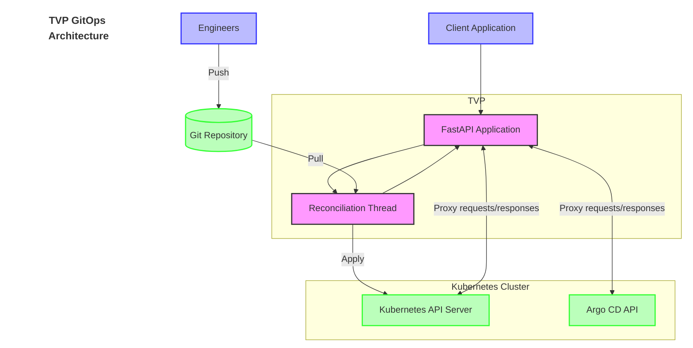

**Leverage Point:** The GitOps principles — [**_Declarative_**, versioned, immutable, **_Pulled automatically_** and **_continuously Reconciled_**](https://opengitops.dev/) — creates leverage by allowing a lean platform team to support hundreds of engineers. By centralizing the infrastructure interaction through a single API layer, the organization gains a force multiplier where each platform engineer's work impacts hundreds of engineers.

Now that we've established the architectural foundation, let's see how engineers actually interact with this powerful system.

## 2. GitOps Workflow Sequence

With our architectural foundation established, let's see how engineers actually interact with this system. The GitOps workflow represents the primary interface between engineers and infrastructure, making complex operations remarkably simple. This sequence diagram illustrates the streamlined experience when an engineer pushes a change:

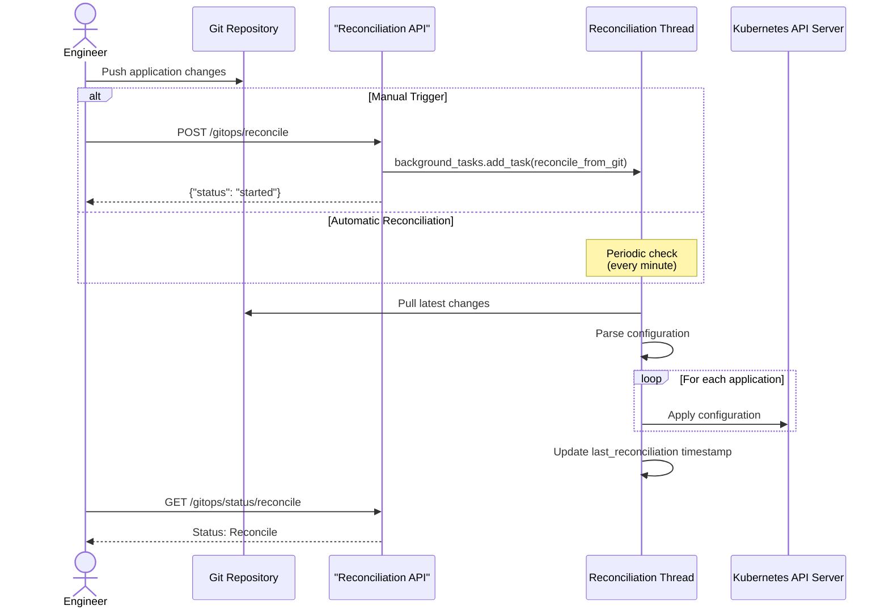

**Leverage Point:** The GitOps workflow provides leverage by enabling a declarative approach to infrastructure. This means that one engineer's work can affect multiple environments consistently, and the source of truth remains in version control rather than in manual configurations.

While this workflow appears simple from the engineer's perspective, there's sophisticated automation working behind the scenes. Let's examine the reconciliation process that makes this seamless experience possible.

## 3. GitOps Reconciliation Process

Behind this simplified developer experience lies a sophisticated reconciliation process. As complexity builds, we see how the platform automatically keeps environments synchronized with the desired state in Git, eliminating manual toil:

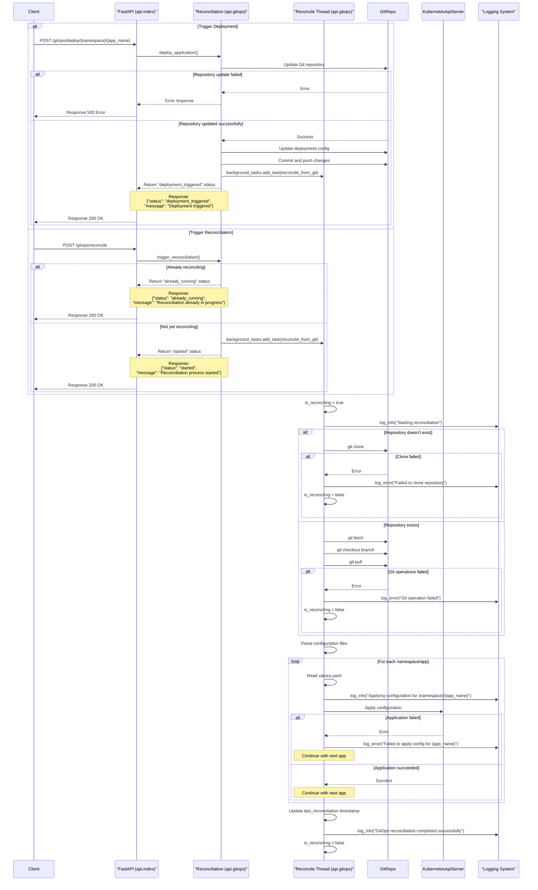

**Leverage Point:** The reconciliation process provides leverage by automating what would otherwise be manual, error-prone operations. One engineer committing a change to Git can trigger consistent updates across multiple environments and services - a significant force multiplier.

To understand how reconciliation works at a deeper level, we need to look at the individual components that make up our platform.

## 4. Component Interaction Diagram

Diving deeper into the system's inner workings, we can examine the components that power our platform. This interaction diagram reveals how the FastAPI application is structured to maximize maintainability and separation of concerns:

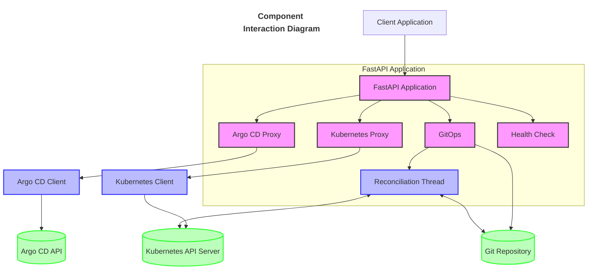

**Leverage Point:** This component structure demonstrates the leverage principle of TVP by separating concerns and enabling multiple teams to work independently. Each component acts as a force multiplier by providing standardized functionality that would otherwise be duplicated across teams.

With these components identified, we can follow how data flows through the system, creating patterns that engineers can rely on.

## 5. Data Flow Diagram

These components don't exist in isolation - they communicate through carefully designed data flows that minimize redundancy and create consistency. As our story progresses, this diagram shows how information moves between components, creating standardized patterns:

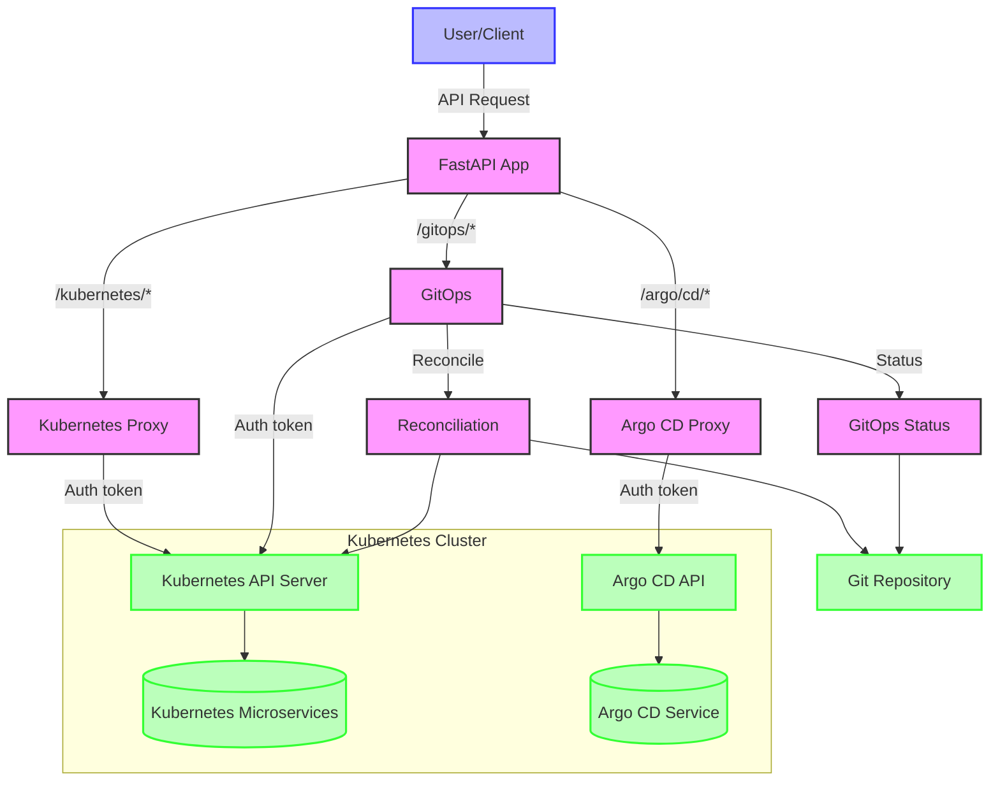

**Leverage Point:** The data flow design creates leverage by standardizing how information moves through the system. This eliminates redundant data handling code across applications and ensures consistent security practices without requiring each team to become security experts.

As our exploration deepens, we arrive at the crucial API structure that serves as the interface between users and platform functionality.

## 6. API Structure Diagram

At the heart of our platform lies the API structure - the central interface that ties everything together. This diagram reveals the elegant organization of endpoints in api/index.py, showing how complexity is contained and exposed through simple interfaces:

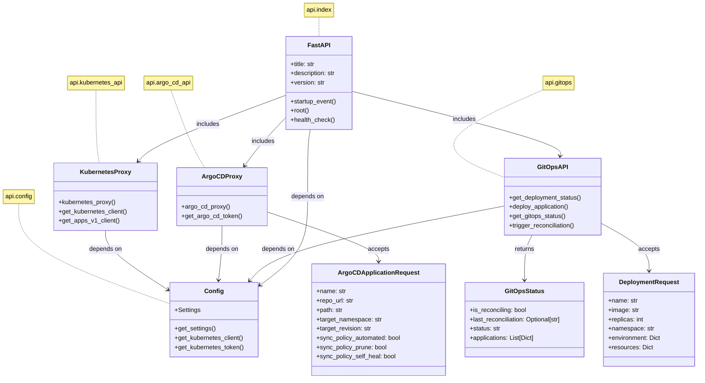

**Leverage Point:** The API structure provides leverage by offering clear, consistent interfaces that hide implementation complexity. Engineering teams can focus on their business logic while the platform handles infrastructure concerns - a classic example of how abstraction creates leverage.

A sophisticated platform needs to be reliable. Let's see how health monitoring ensures the system remains operational even as complexity increases.

## 7. Health Check Sequence

With increased complexity comes the need for reliability. The health check mechanism acts as the platform's nervous system, constantly monitoring component states to ensure operational integrity. This sequence shows how health checks verify system readiness:

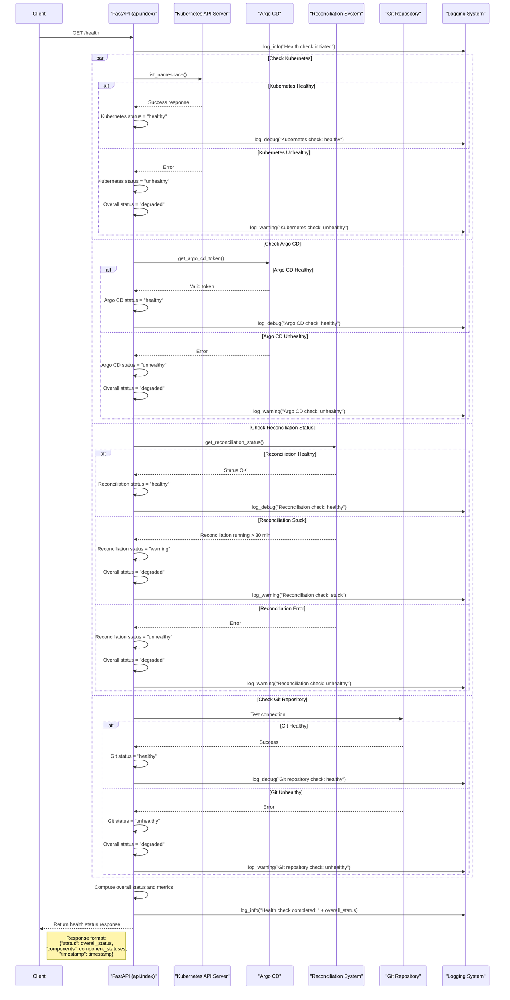

**Leverage Point:** The health check system creates leverage by centralizing monitoring. Rather than each team building their own health monitoring, the platform provides this as a service, multiplying the effectiveness of operational efforts.

Now we reach the crucial capability that delivers immense leverage: abstracting away Kubernetes complexity through our proxy system.

## 8. Kubernetes Proxy Sequence

We've now reached the core capability of our platform: secure access to underlying infrastructure. The Kubernetes Proxy represents the primary leverage point, where platform engineering effort creates enormous value. This diagram shows how the proxy securely connects engineers to Kubernetes without requiring specialized expertise:

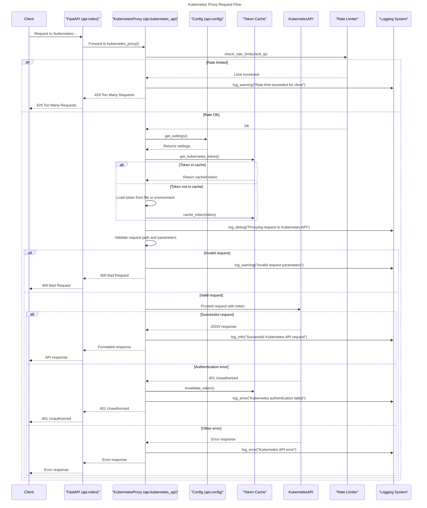

**Leverage Point:** The Kubernetes proxy demonstrates leverage by providing secure, consistent access to Kubernetes resources without requiring each engineer to understand Kubernetes authentication and API complexities. One implementation serves many consumers.

With Kubernetes access solved, we complete our core capabilities by providing similar abstraction for GitOps workflows through the Argo CD proxy.

## 9. Argo CD Proxy Sequence

Similarly critical is our Argo CD integration, which extends the platform's reach to GitOps deployment workflows. The proxy flow shown here creates a seamless experience for engineers while maintaining security boundaries:

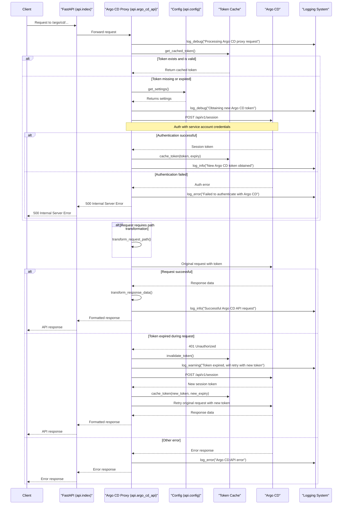

**Leverage Point:** The Argo CD proxy creates leverage by abstracting away the complexities of GitOps tooling. This allows engineering teams to benefit from GitOps workflows without needing to become Argo CD experts, multiplying the impact of the platform team's expertise.

With all these elements in place, we can now see how they combine to create a complete microservices deployment workflow - the ultimate value proposition of our platform.

## 10. Microservices Deployment Workflow

All these components and interactions culminate in the microservices deployment workflow. This state diagram shows how the various parts work in harmony to deliver applications from code to production, resolving the complexity we've built up throughout our journey:

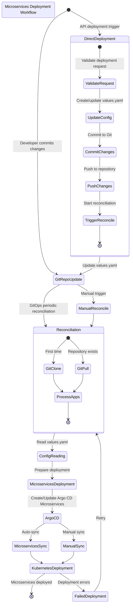

**Leverage Point:** This Microservices Deployment Workflow demonstrates how TVP creates leverage through standardization and automation. Engineering teams follow a consistent path to production, benefiting from platform capabilities that would be prohibitively expensive for each team to build independently.

Underpinning this entire system is a comprehensive testing strategy that ensures reliability and sustainability.

## 11. Test Coverage Structure

To ensure this system remains stable and can evolve over time, comprehensive testing underpins everything. This final diagram shows how test coverage validates each component, creating confidence that the platform will continue to deliver leverage:

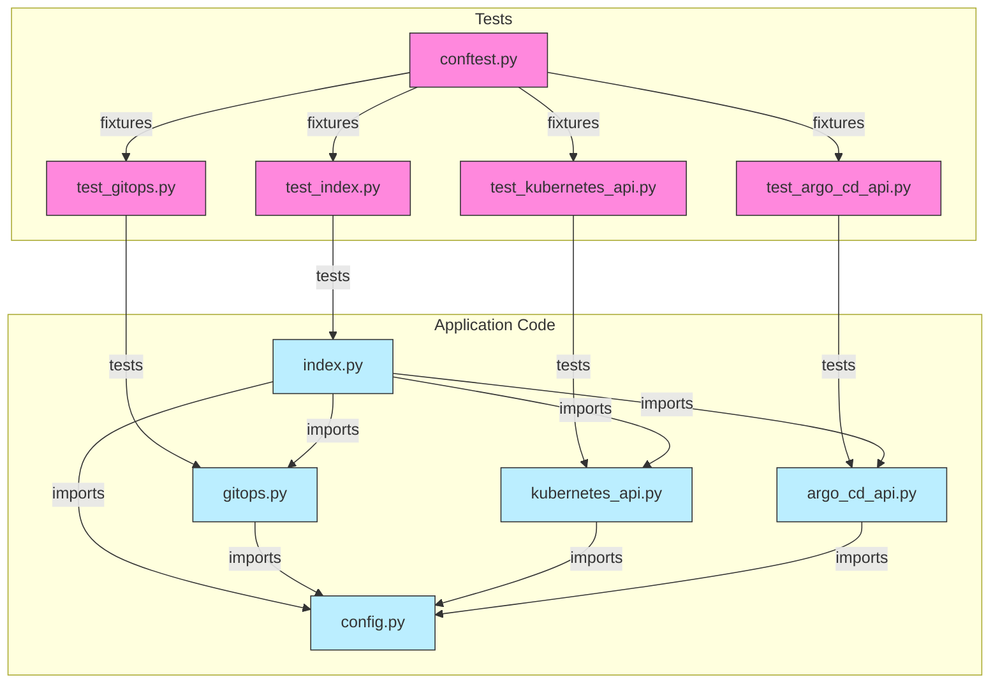

**Leverage Point:** Comprehensive test coverage creates leverage by ensuring that platform updates don't introduce regressions. This provides confidence to both the platform team and application engineers, enabling faster iteration and more frequent releases.

## 12. Measuring Platform Leverage

**The proof is in the numbers.** When leverage is properly applied, the results are dramatic and measurable. Here are sample numbers and hypothetical outcomes that our TVP approach may deliver:

1. **Engineer Time Multiplication**: For every hour spent by the platform team, we save approximately 20 hours of development time across application teams.

2. **Deployment Frequency**: Teams using our platform deploy 4x more frequently than teams managing their own infrastructure.

3. **Onboarding Acceleration**: New engineers become productive in 3 days versus 3 weeks without the platform.

4. **Standardization Benefits**: Security audits take 70% less time due to consistent patterns and controls.

5. **Cognitive Load Reduction**: Engineers report spending 30% more time on business logic and 30% less time on infrastructure concerns.

6. **Support Ratio**: Our platform team of 5 effectively supports 25 application teams (100+ engineers).

These sample metrics demonstrate the leverage that comes from building a carefully designed Thinnest Viable Platform.

For comprehensive metrics, please see [Measurement Frameworks](#measurement-frameworks).

## 13. Conclusion: The Multiplication of Force

Throughout this architectural journey, we've seen how the Thinnest Viable Platform embodies Archimedes' famous principle: "Give me a lever long enough and a fulcrum on which to place it, and I shall move the world." By strategically positioning our platform components as leverage points, we've created a system where the effort of a lean platform team multiplies across the broader organization.

This is the essence of successful platform engineering - not building every feature requested, but carefully selecting the minimum set of abstractions that deliver maximum impact. Just as a physical lever transforms a small force into a much larger one, our TVP transmutes the effort of platform engineers into outsized productivity gains for all engineering teams.

**The question now is:** Where in your organization can you apply these same principles? Which cognitive loads can you remove from your engineers? What minimum viable abstractions would create the greatest leverage in your context?

---

# Appendix

---

# Platform Engineering Communities:

---

## [Cloud Native Computing Foundation (CNCF) Platforms Working Group](https://tag-app-delivery.cncf.io/wgs/platforms/)

### Working mode / expected outcome

> The group discusses concepts, plans and develops a demo infrastructure (as code) to handle these use cases (e.g. App-Ready-Platform as code). This might be implemented using different tools (link to landscape) and could be a blueprint for end users. Furthermore, the validated best practices might then be documented in a white paper.

### Goals

> _Focusing on the key stakeholder, who in this scenario is an engineer potentially with a CKA/CKAD looking to enable the delivery of an application workload on cloud infrastructure._

> - Vendor and End-user interviews.
> - Focused questions that help identify successes and frustrations of products.
> - Capturing the current practices and the landscape.
> - Landscape radar
> - Provide interoperability examples between IaC and CD tools in the Podtato-head project.
> - Give end-users ideas and examples of how they could integrate application and infrastructure deployment.
> - Provide patterns in a white paper based on practical work and how end-users are implementing them. Present practices and trends seen occurring within the industry that would be valuable to highlight to end-users.

### Non-Goals

> - Creating a new type of standard
> - An opinion on how to build microservice applications or cloud-native architecture
> - Defining how deployments should be done
> - Creation of a new CNCF open source project

---

## [Cloud Native Operational Excellence (CNOE) Community](https://cnoe.io/)

## What is CNOE?

> CNOE is an open community collaboration with the goal of helping facilitate platform engineering through the sharing of guidance, tooling, and internal developer platform (IDP) reference architectures.

> - Enterprises that adopt OSS as the foundation of their cloud platforms face the challenge of choosing technologies that will support their business outcomes for 3-5 years.
> - The cost of retooling and re-platforming for large organizations is high, which makes bets on specific technologies fundamental to their technology strategies.
> - In order to de-risk these bets, enterprises take into consideration the investments of their peer organizations.
> - The goal for the CNOE framework is to bring together a cohort of enterprises operating at the same scale so that they can navigate their operational technology decisions together, de-risk their tooling bets, coordinate contribution, and offer guidance to large enterprises on which CNCF technologies to use together to achieve the best cloud efficiencies.

## What CNOE is not

> 1. not only a unified control plane but building blocks for them to expand and extend the unified control plane

> 2. not only a CI/CD tool but other components and capabilities that extend and enhance the integration and delivery of applications

> 3. not new technologies or set of managed services, but a way to interact and integrate. There is still an expectation that companies will need to fund and operate the various open source tools used within the IDP

> 4. not installers or proprietary packaging mechanisms. it will be fully open source and customizable and available to use by any one

> 5. not responsible for operationalizing of the toolchain. There is still an expectation that companies will need to fund and operate the various open source tools used within the IDP

## [Technology Choices](https://cnoe.io/docs/intro/technology)

> The goal for CNOE is to capture and provide references for tools commonly used by platform engineers to design their IDPs, the way these tools are configured, and implementations for common patterns and practices that can be extended and used across organizations.

---

# Measurement Frameworks:

---

## [SRE: The Four Golden Signals of Site Reliablity Engineering](https://sre.google/sre-book/monitoring-distributed-systems/#xref_monitoring_golden-signals)

> **The Four Golden Signals**
> 
> The four golden signals of monitoring are latency, traffic, errors, and saturation. If you can only measure four metrics of your user-facing system, focus on these four.
> 
> **Latency**
> 
> - The time it takes to service a request. It’s important to distinguish between the latency of successful requests and the latency of failed requests. For example, an HTTP 500 error triggered due to loss of connection to a database or other critical backend might be served very quickly; however, as an HTTP 500 error indicates a failed request, factoring 500s into your overall latency might result in misleading calculations. On the other hand, a slow error is even worse than a fast error! Therefore, it’s important to track error latency, as opposed to just filtering out errors.
> 
> **Traffic**
> 
> - A measure of how much demand is being placed on your system, measured in a high-level system-specific metric. For a web service, this measurement is usually HTTP requests per second, perhaps broken out by the nature of the requests (e.g., static versus dynamic content). For an audio streaming system, this measurement might focus on network I/O rate or concurrent sessions. For a key-value storage system, this measurement might be transactions and retrievals per second.
> 
> **Errors**
> 
> - The rate of requests that fail, either explicitly (e.g., HTTP 500s), implicitly (for example, an HTTP 200 success response, but coupled with the wrong content), or by policy (for example, "If you committed to one-second response times, any request over one second is an error"). Where protocol response codes are insufficient to express all failure conditions, secondary (internal) protocols may be necessary to track partial failure modes. Monitoring these cases can be drastically different: catching HTTP 500s at your load balancer can do a decent job of catching all completely failed requests, while only end-to-end system tests can detect that you’re serving the wrong content.
> 
> **Saturation**
> 
> - How "full" your service is. A measure of your system fraction, emphasizing the resources that are most constrained (e.g., in a memory-constrained system, show memory; in an I/O-constrained system, show I/O). Note that many systems degrade in performance before they achieve 100% utilization, so having a utilization target is essential.
> 
> - In complex systems, saturation can be supplemented with higher-level load measurement: can your service properly handle double the traffic, handle only 10% more traffic, or handle even less traffic than it currently receives? For very simple services that have no parameters that alter the complexity of the request (e.g., "Give me a nonce" or "I need a globally unique monotonic integer") that rarely change configuration, a static value from a load test might be adequate. As discussed in the previous paragraph, however, most services need to use indirect signals like CPU utilization or network bandwidth that have a known upper bound. Latency increases are often a leading indicator of saturation. Measuring your 99th percentile response time over some small window (e.g., one minute) can give a very early signal of saturation.
> 
> - Finally, saturation is also concerned with predictions of impending saturation, such as "It looks like your database will fill its hard drive in 4 hours."
> 
> If you measure all four golden signals and page a human when one signal is problematic (or, in the case of saturation, nearly problematic), your service will be at least decently covered by monitoring.

---

## [DORA: Core Model of DevOps Research and Assessment](https://dora.dev/research/?view=detail)

---

## [The SPACE of Developer Productivity: There's more to it than you think](https://queue.acm.org/detail.cfm?id=3454124)

---

## [DevEx: What Actually Drives Productivity: The developer-centric approach to measuring and improving productivity](https://queue.acm.org/detail.cfm?id=3595878)

---

## [PULSE and HEART: Measuring the User Experience on a Large Scale: User-Centered Metrics for Web Applications](https://research.google/pubs/measuring-the-user-experience-on-a-large-scale-user-centered-metrics-for-web-applications/)

> More and more products and services are being deployed
on the web, and this presents new challenges and
opportunities for measurement of user experience on a large
scale. There is a strong need for user-centered metrics for
web applications, which can be used to measure progress
towards key goals, and drive product decisions. In this
note, we describe the HEART framework for user-centered
metrics, as well as a process for mapping product goals to
metrics. We include practical examples of how HEART
metrics have helped product teams make decisions that are
both data-driven and user-centered. The framework and
process have generalized to enough of our company’s own
products that we are confident that teams in other
organizations will be able to reuse or adapt them. We also
hope to encourage more research into metrics based on
large-scale behavioral data.

> **PULSE METRICS**
> The most commonly used large-scale metrics are focused
on business or technical aspects of a product, and they (or
similar variations) are widely used by many organizations
to track overall product health. We call these PULSE
metrics:

> **P**age views,

> **U**ptime,

> **L**atency,

> **S**even-day active users (i.e. the number of unique users who used the product
at least once in the last week), and

> **E**arnings.

> **HEART METRICS**
> Based on the shortcomings we saw in PULSE, both for
measuring user experience quality, and providing
actionable data, we created a complementary metrics
framework, HEART:

> **H**appiness,

> **E**ngagement,

> **A**doption,

> **R**etention, and

> **T**ask success.

> These are categories, from
which teams can then define the specific metrics that they
will use to track progress towards goals. The Happiness and
Task Success categories are generalized from existing user
experience metrics: Happiness incorporates satisfaction,
and Task Success incorporates both effectiveness and
efficiency. Engagement, Adoption, and Retention are new
categories, made possible by large-scale behavioral data. 

---

## [CASTLE: A UX Framework for Workplace Software](https://www.nngroup.com/articles/castle-framework/)

> The HEART framework is great for B2C products but is lacking for workplace applications where users cannot choose the product. CASTLE offers a complementary assessment framework for UX that focuses on the needs of internal product teams.

> CASTLE is an acronym for:

> C = Cognitive load

> A = Advanced feature usage

> S = Satisfaction

> T = Task efficiency

> L = Learnability

> E = Errors

> Much like in the HEART framework, the six dimensions are constructs intended to represent the most important elements of user experience for productivity applications that are used as part of someone’s job. The selection of these constructs has taken into account general user-experience principles and priorities, as well as typical business cases and needs for workplace software.

---

## [Trade Me's Journey Towards a TVP](https://teamtopologies.com/industry-examples/trade-me-journey-towards-a-thinnest-viable-platform)

### Just big enough:
 
> TVP intends to ensure the absolute minimum requirements we expect from our production systems are implemented and abstracted away from our developers. This way, we keep the platform as simple as possible to cater to one of its primary purposes: reducing developers’ cognitive load. As the “Thinnest” in the abbreviation implies, it is just big enough. We look at parts of systems that are common across all domains. For example, every system needs monitoring. We provide this out of the box with TVP, so developers don’t need to remember to add monitoring when creating a new service; it’s automatically provided with our chosen monitoring tool. 

> The diagram above is a simplified version of how teams interact with a TVP.  We have three stream-aligned teams that work on the platform. Stream-aligned teams from Consumer & Marketplace and Classifieds use a TVP to build their new services. The team that owns TVP will provide support for TVP’s users, and will continually improve a TVP user experience based on feedback with pushed updates. The process and experience resembles that of any third-party software, except all done internally. 

---

## [Team Topologies Quick Reference Card (QRC) by Henny Portman](https://hennyportman.wordpress.com/2020/05/25/review-team-topologies/)

---

# Recap:

---

## Key Concepts:

• **TVP:** A platform with minimum necessary components that creates maximum value — just big enough — to reduce developers' cognitive load while providing composable building blocks

• **Leverage:** The idea that effort from a few platform engineers can reduce effort across the broader organization by curating well-designed APIs

• **Value Proposition:** Creating leverage through platform engineering, allowing a small team to increase effectiveness across an organization significantly

• **Product Thinking:** Treating the platform as a product with internal teams as customers, focusing on their needs rather than wants

• **Declarative Automation:** Shifting the focus from how to achieve a result (imperative programming) to what result to achieve (declarative programming) as a key leverage point

• **GitOps Principles:** Declarative, versioned, immutable, pulled automatically and continuously reconciled

• **Measurement Frameworks:** The Four Golden Signals (SRE), DORA, SPACE, DevEx, PULSE, HEART and CASTLE

• **Key Principles of TVP:**

  - Use modern software development techniques within the platform team

  - Focus on _Product Thinking_, viewing internal teams as customers

  - Accelerate and simplify software delivery for teams using the platform

  - Build only what is _necessary - Thinnest Viable_

---

## TVP through Leverage:

• It is achieved by curating well-defined APIs that simplify infrastructure access and applying product thinking to maximize value

• We are building a TVP, a declarative automation product, to accelerate application software engineering by providing composable building blocks

• The core value of platform engineering is leverage, enabling a lean platform team to reduce effort and improve effectiveness across the broader organization significantly

---

## For more information:

https://lloydchang-tvp.vercel.app/redoc

