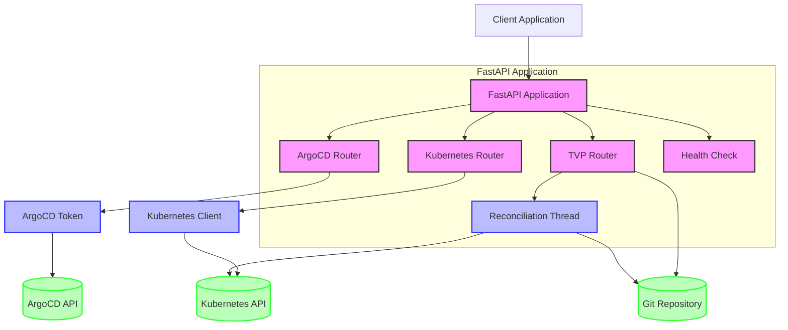
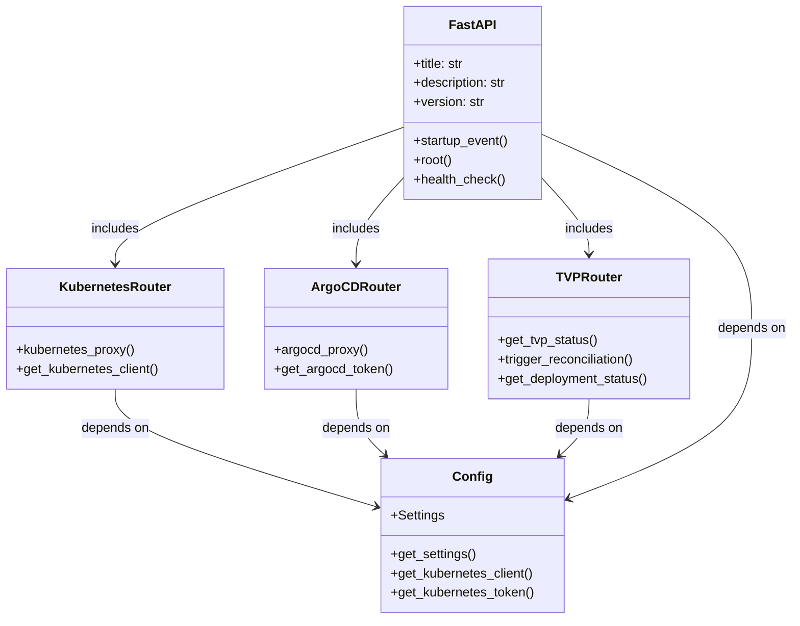
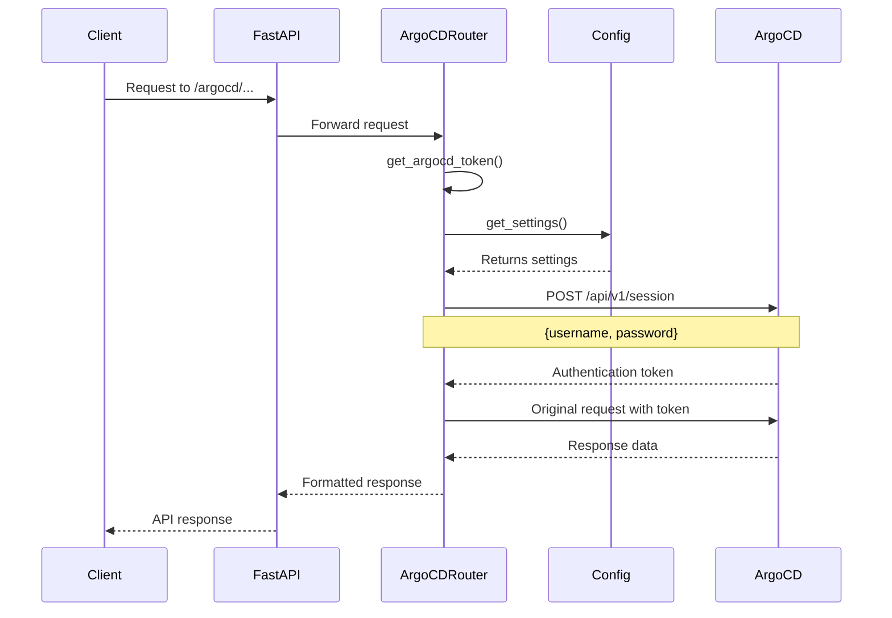
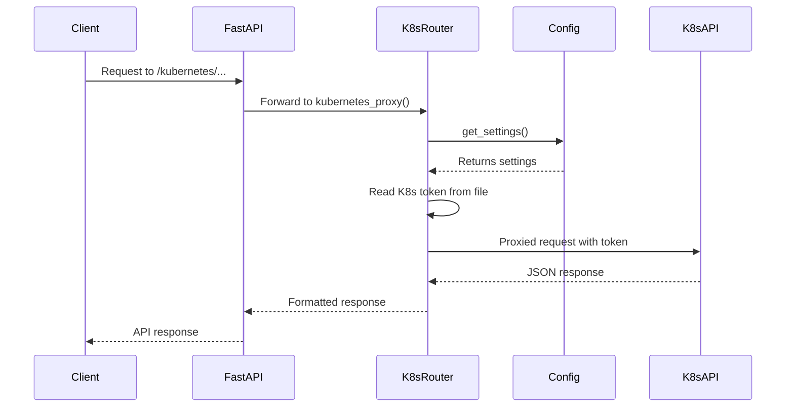
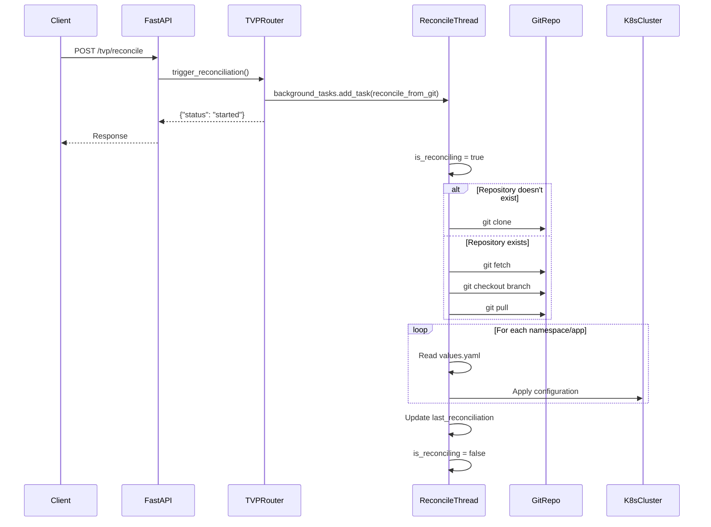
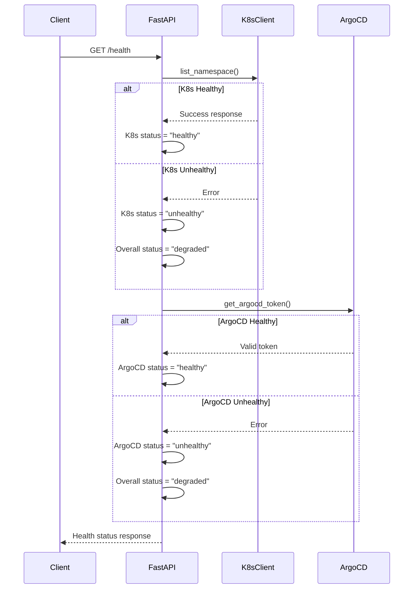
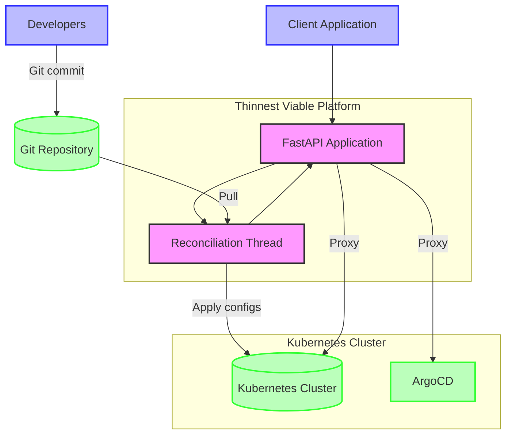
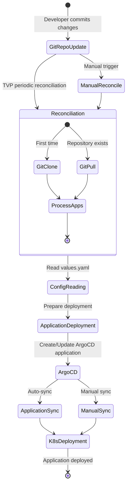
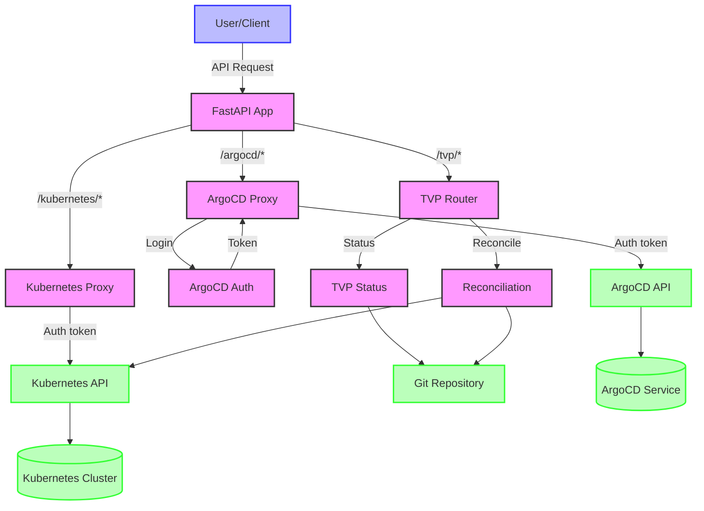

# Thinnest Viable Platform (TVP)

# Backstory:

- [**Cloud Native Computing Foundation (CNCF) Platforms White Paper**](https://tag-app-delivery.cncf.io/whitepapers/platforms/)

> Inspired by the cross-functional cooperation promised by DevOps, platform engineering has begun to emerge in enterprises as an explicit form of that cooperation. Platforms curate and present foundational capabilities, frameworks and experiences to facilitate and accelerate the work of internal customers such as application developers, data scientists and information workers. Particularly in cloud computing, platforms have helped enterprises realize values long promised by the cloud like fast product releases, portability across infrastructures, more secure and resilient products, and greater developer productivity.

## Who is the audience?

> This paper intends to support enterprise leaders, enterprise architects and platform team leaders to advocate for, investigate and plan internal platforms for cloud computing. We believe platforms significantly impact enterprises’ actual value streams, but only indirectly, so leadership consensus and support is vital to the long-term sustainability and success of platform teams. In this paper we’ll enable that support by discussing what the value of platforms is, how to measure that value, and how to implement platform teams that maximize it.

## Why platforms?

> A team of platform experts not only reduces common work demanded of product teams but also optimizes platform capabilities used in those products. A platform team also maintains a set of conventional patterns, knowledge and tools used broadly across the enterprise; enabling developers to quickly contribute to other teams and products built on the same foundations. The shared platform patterns also allow embedding governance and controls in templates, patterns and capabilities. Finally, because platform teams corral providers and provide consistent experiences over their offerings, they enable efficient use of public clouds and service providers for foundational but undifferentiated capabilities such as databases, identity access, infrastructure operations, and app lifecycle.

## What is a Platform?

> A platform for cloud-native computing is an integrated collection of capabilities defined and presented according to the needs of the platform’s users. It is a cross-cutting layer that ensures a consistent experience for acquiring and integrating typical capabilities and services for a broad set of applications and use cases. A good platform provides consistent user experiences for using and managing its capabilities and services, such as Web portals, project templates, and self-service APIs.

---

# Defining “Platform” and Other Important Terms:

- [**O'Reilly: Platform Engineering: A Guide for Technical, Product, and People Leaders**](https://www.oreilly.com/library/view/platform-engineering/9781098153632/ch01.html)

## Platform

> We use [Evan Bottcher’s definition from 2018](https://martinfowler.com/articles/talk-about-platforms.html), with a couple of terms updated. A platform is a foundation of self-service APIs, tools, services, knowledge, and support that are arranged as a compelling internal product. Autonomous application teams[1](https://www.oreilly.com/library/view/platform-engineering/9781098153632/ch01.html#id316) can make use of the platform to deliver product features at a higher pace, with reduced coordination.

> A corollary here is to ask: what, then, isn’t a platform? Well, for the purposes of this book, a platform requires you to be doing platform engineering. So, a wiki page isn’t a platform, because there’s no engineering to be done. “The cloud” also is not a platform by itself; you can bring cloud products together to create an internal platform, but on its own the cloud is an overwhelming array of offerings that is too large to be seen as a coherent platform.

## Platform engineering

> Platform engineering is the discipline of developing and operating platforms. The goal of this discipline is to manage overall system complexity in order to deliver leverage to the business. It does this by taking a curated product approach to developing platforms as software-based abstractions that serve a broad base of application developers, operating them as foundations of the business. We will elaborate on this in [Chapter 2](https://www.oreilly.com/library/view/platform-engineering/9781098153632/ch02.html#ch02_the_pillars_of_platform_engineering_1724889300873458).

## Leverage

> Core to the value of platform engineering is the concept of leverage—meaning, the work of a few engineers on a platform team reduces the work of the greater organization. Platforms achieve leverage in two ways: making applications engineers more productive as they go about their jobs creating business value, and making the engineering organization more efficient by eliminating duplicate work across application engineering teams.

## Product

> We believe that it is essential to view a platform as a product. Developing platforms as compelling products means that we take a customer-centric approach when deciding on the features of a platform. This implies a core focus on the users, but it requires more than just performatively hiring product managers and calling it a day. With the word “product” we strive to achieve for platforms what Steve Jobs created with Apple products: against a broad range of demand for features the product is deliberately and tastefully curated, both through what it does and, more importantly, through what it leaves out.

---

## What is a Thinnest Viable Platform (TVP)?

A TVP is a careful balance between keeping the platform small and ensuring that the platform is helping to accelerate and simplify software delivery for teams building on the platform. The concept was [introduced](https://teamtopologies.com/key-concepts-content/what-is-a-thinnest-viable-platform-tvp) by [Matthew Skelton](https://www.linkedin.com/in/matthewskelton/) and [Manuel Pais](https://www.linkedin.com/in/manuelpais/), co-authors of the book [_Team Topologies_](https://teamtopologies.com/book).

### Key Principles of TVP:

- **Use modern software development techniques within the platform team**
  - [**Platform Engineering Maturity Model**](https://tag-app-delivery.cncf.io/whitepapers/platform-eng-maturity-model/)
    > CNCF’s initial [Platforms White Paper](https://tag-app-delivery.cncf.io/whitepapers/platforms/) describes what internal platforms for cloud computing are and the values they promise to deliver to enterprises. But to achieve those values an organization must reflect and deliberately pursue outcomes and practices that are impactful for them, keeping in mind that every organization relies on an internal platform crafted for its own organization - even if that platform is just documentation on how to use third party services. This maturity model provides a framework for that reflection and for identifying opportunities for improvement in any organization.
- **Focus on _product thinking_, viewing internal teams as customers**
  - [Sprinkle your DevOps platform with **_product thinking_**](https://www.youtube.com/watch?v=rgV4HLSd1dk) by [Javier Turegano](https://www.linkedin.com/in/jturegano/) and [Leoren Tanyag Tesaluna](https://www.linkedin.com/in/leoren-tesaluna/)
  - [**r/ProductManagement**: How applicable are Marty Cagan thoughts on the real world](https://www.reddit.com/r/ProductManagement/comments/1c5qztz/how_applicable_are_marty_cagan_thoughts_on_the/)
- **Accelerate and simplify software delivery for teams using the platform**
  - [**r/ExperiencedDevs**: Curious what peoples experiences with Platform Teams are - what does your Platform Team do and how do they help other teams deliver?](https://www.reddit.com/r/ExperiencedDevs/comments/1dtwsij/curious_what_peoples_experiences_with_platform/)
- **Build only what is _necessary_ - "thinnest viable"**
  - **Differentiate between customer wants and customer needs**
    - Customers may not always get what they want because it doesn’t **_necessarily_** address their actual needs

As Matthew Skelton [explains](https://www.youtube.com/watch?v=8AQPSR09bxk):

> The interesting thing about platform is - it's maybe not the platform's of the past, because platforms of the past often in many organizations were great big great massive things, very difficult to use... The platforms we're talking about have placed a strong focus on developer experience, they see other development teams as their customers effectively.

### TVP Definition:

A Thinnest Viable Platform is the smallest set of APIs, documentation, and tools needed to accelerate the teams developing modern software services and systems.

### Examples of TVP:

- A wiki page defining which cloud services to use and how to use them
  - https://github.com/TeamTopologies/Thin-Platform-template
  - https://github.com/TeamTopologies/Thinnest-Viable-Platform-examples
  - https://github.com/sbalnojan/TVP-example
- Documentation and tools focused on reducing cognitive load for development teams
  - https://teamtopologies.com/industry-examples/trade-me-journey-towards-a-thinnest-viable-platform
  - https://cnoe.io/
    - https://github.com/cnoe-io/idpbuilder
  - https://github.com/backstage/backstage
    - https://github.com/backstage
  - https://roadie.io/
  - https://www.atlassian.com/software/compass
- A set of curated APIs with simplified access to infrastructure
  - https://github.com/lloydchang/tvp

## System Architecture Documentation

This [README.md](https://github.com/lloydchang/tvp/blob/main/README.md) provides a visual overview of the system architecture using various diagrams.

## 1. Component Interaction Diagram

## 2. API Structure Diagram

## 3. ArgoCD Authentication Sequence

## 4. Kubernetes Proxy Sequence

## 5. TVP GitOps Reconciliation Sequence

## 6. Health Check Sequence

## 7. TVP GitOps Architecture

## 8. Application Deployment Workflow

## 9. Data Flow Diagram

